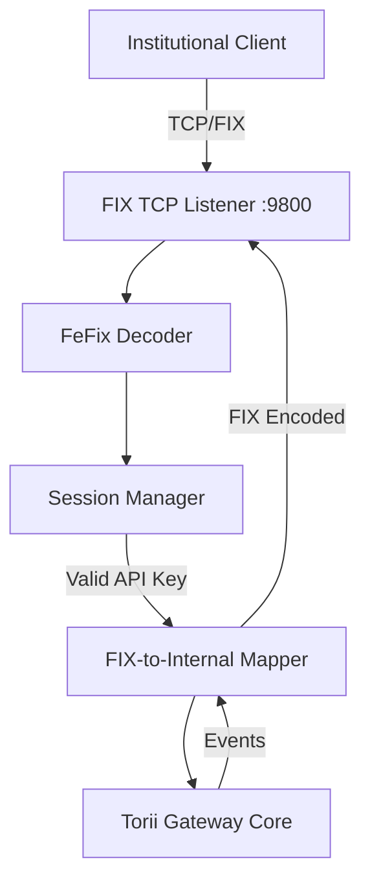

# FIX API Design Specification (v1)

## Overview
The Financial Information eXchange (FIX) API provides a standard interface for institutional clients to submit orders and receive market data.

-   **Version**: FIX 4.4 (Industry Standard).
-   **Transprot**: TCP/IP.
-   **Port**: `9800` (Default).
-   **Engine**: Rust `fefix` (Fast, allocation-free decoder).

## Session Layer
-   **Logon (A)**: Authentication via senderCompID (API Key ID) and raw data (API Secret/Hash).
-   **Heartbeat (0)**: Standard keep-alive (default 30s).
-   **ResendRequest (2)**: Replay of missed messages during disconnection.
-   **Logout (5)**: Graceful session termination.

## Application Messages

### Inbound (Client -> Server)
| MsgType | Name | Description | Mapping |
| :--- | :--- | :--- | :--- |
| `D` | **NewOrderSingle** | Place a new trade order. | Maps to `POST /v1/orders` |
| `F` | **OrderCancelRequest** | Cancel an existing order. | Maps to `DELETE /v1/orders/{id}` |
| `V` | **MarketDataRequest** | Subscribe to live book data. | Maps to WebSocket Subscription |

### Outbound (Server -> Client)
| MsgType | Name | Description | Mapping |
| :--- | :--- | :--- | :--- |
| `8` | **ExecutionReport** | Order status (Filled, Rejected). | Maps to Order Event Stream |
| `W` | **SnapshotFullRefresh** | Initial L2 Order Book state. | Maps to WebSocket Snapshot |
| `X` | **IncrementalRefresh** | Real-time L2 updates. | Maps to WebSocket Delta |

## Architecture

## Implementation Strategy
1.  **Dependencies**: Add `fefix` and `tokio-util` (Codec) to `Cargo.toml`.
2.  **Listener**: Spawn a dedicated Tokio task binding to port `9800`.
3.  **Decoder**: Use `fefix::tagvalue::Decoder` for stream parsing.
4.  **Bridge**: Implement a `FixConnection` struct that holds a channel to the main `AppState`.
